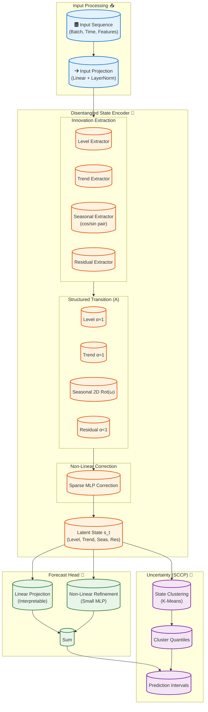

```mermaid
flowchart TB
    subgraph Input["Input Processing 📥"]
        X[("fa:fa-database Input Sequence\n(Batch, Time, Features)")]
        Proj[("fa:fa-arrow-right Input Projection\n(Linear + LayerNorm)")]
        X --> Proj
    end

    subgraph Encoder["Disentangled State Encoder 🔄"]
        direction TB
        
        subgraph extraction["Innovation Extraction"]
            E1[("Level Extractor")]
            E2[("Trend Extractor")]
            E3[("Seasonal Extractor\n(cos/sin pair)")]
            E4[("Residual Extractor")]
        end
        
        subgraph transition["Structured Transition (A)"]
            T1[("Level α≈1")]
            T2[("Trend α≈1")]
            T3[("Seasonal 2D Rot(ω)")]
            T4[("Residual α<1")]
        end
        
        subgraph correction["Non-Linear Correction"]
            MLP[("Sparse MLP Correction")]
        end
        
        Proj --> extraction
        extraction --> transition
        transition --> MLP
        MLP --> State[("Latent State s_t\n(Level, Trend, Seas, Res)")]
    end
    
    subgraph Forecast["Forecast Head 🔮"]
        Linear[("Linear Projection\n(Interpretable)")]
        NonLinear[("Non-Linear Refinement\n(Small MLP)")]
        Sum[("Sum")]
        
        State --> Linear
        State --> NonLinear
        Linear --> Sum
        NonLinear --> Sum
    end
    
    subgraph Conformal["Uncertainty (SCCP) 📏"]
        Cluster[("State Clustering\n(K-Means)")]
        Quantile[("Cluster Quantiles")]
        Intervals[("Prediction Intervals")]
        
        State --> Cluster
        Cluster --> Quantile
        Sum --> Intervals
        Quantile --> Intervals
    end

    classDef input fill:#e3f2fd,stroke:#1976d2,stroke-width:2px;
    classDef encoder fill:#fff3e0,stroke:#e65100,stroke-width:2px;
    classDef forecast fill:#e8f5e9,stroke:#2e7d32,stroke-width:2px;
    classDef conformal fill:#f3e5f5,stroke:#7b1fa2,stroke-width:2px;
    
    class X,Proj input;
    class E1,E2,E3,E4,T1,T2,T3,T4,MLP,State encoder;
    class Linear,NonLinear,Sum forecast;
    class Cluster,Quantile,Intervals conformal;
```